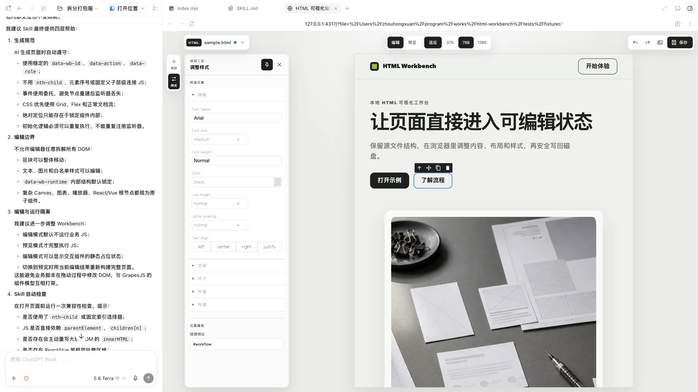

<p align="center">
  
</p>

<p align="center">
  <strong>English</strong> · <a href="./README.zh-CN.md">中文</a>
</p>

# HTML Workbench

Turn an existing HTML page into a local workspace where people can edit it visually, preview its interactions, and save changes back to disk.

The workflow is simple: create a page with the tool you prefer, refine copy, images, layout, and styling directly in the browser, then switch to Preview to test buttons, links, and page behavior. Both people and AI continue to work from the same HTML source file.

> **HTML Workbench is not an HTML generator.** Create HTML however you prefer—with any AI, design tool, template, or hand-written code—then give that file to HTML Workbench. It turns the existing document into a visual editor with preview and real-time collaboration against the same source file.

## DeepSeek Harness plugin

HTML Workbench is also a first-class plugin for [DeepSeek Harness](https://github.com/deepseek-ai/DeepSeek-Harness) — the agent harness this tooling plugs into — published as [`@vibe-x/dsh-html-workbench`](./dsh-plugin/). DeepSeek Harness ships a built-in plugin system, and this plugin brings the visual editor straight into its web UI's right sidebar: no separate browser window and no manual `open` command.

As the agent creates or edits `.html` files (through the `write` / `edit` tools), the panel tracks them automatically. Open one to edit copy, images, layout, and styles in the embedded GrapesJS editor, switch to **Preview** to test interactions, then **Save** to write the result back to the same source file.

### Install

Prerequisites: [DeepSeek Harness](https://github.com/deepseek-ai/DeepSeek-Harness) installed and `dsh web` running, Node.js ≥ 20, and Python 3.9+.

```bash
dsh plugin --profile web add @vibe-x/dsh-html-workbench
```

Restart `dsh web` and hard-refresh the browser (Cmd/Ctrl+Shift+R). A trigger button appears in the top-right of the web UI.

### Use

1. Ask the agent to create or edit an `.html` file in the workspace. The plugin picks it up automatically.
2. Click the top-right trigger to open the panel and choose a file; it loads in the embedded editor.
3. Edit in **Edit** mode, verify interactions in **Preview**, then **Save** to write back to the original file.

The plugin reuses a running local HTML Workbench service when one exists, or starts one in the background — and stops the process it started when the plugin unloads. Everything stays on `127.0.0.1`.

> **Development:** the plugin source lives in [`dsh-plugin/`](./dsh-plugin/). Build its distributable artifacts (client bundle, bundled Python service, frontend) with `node dsh-plugin/build.mjs`, or `cd dsh-plugin && npm run build`.

## What it solves

- Avoid repeated chat-based requests such as “move this title down by 20 pixels.”
- Skip scaffolding a full frontend project for a single landing page.
- Edit visually while preserving real page interactions in Preview mode.
- Keep the service on local `127.0.0.1`; files are never exposed to the LAN.
- Use revision checks to prevent an outdated editor state from overwriting changes made by AI or another tool.

## Recommended workflow

First create one self-contained HTML page with the tool of your choice, then open it in Workbench. Keep its HTML, CSS, JavaScript, and required visual assets in one `.html` file, without a CDN or extra project directory. This makes the page easier to copy, open, edit, and share reliably.

Generate interactions according to the Workbench compatibility rules. Use stable semantic markers instead of relying on `nth-child`, DOM ancestry, or node ordering. The Skill checks these common risks before opening the page.

```text
Create one HTML file
        ↓
Compatibility validation
        ↓
Open and edit in HTML Workbench
        ↓
Switch to Preview and verify interactions
        ↓
Save back to the original HTML file
```

## Quick start

End users need Python 3.9 or later—no Node.js, npm, or pip packages.

Validate a newly created single-file page:

```bash
python3 skill/html-workbench/scripts/validate_html.py \
  --require-self-contained \
  /absolute/path/page.html
```

Then open it:

```bash
python3 skill/html-workbench/scripts/workbench.py open /absolute/path/page.html
```

`open` is the only service command needed in normal use. It reuses a running local service when available, or starts one in the background when needed. Its JSON output contains the editor `url`; open that URL in any browser. Agents with browser control can open it automatically.

Only use the following command when you explicitly want to manage a foreground service:

```bash
python3 skill/html-workbench/scripts/workbench.py serve
```

## Edit and preview

- **Edit mode**: Select elements, change text, replace images, adjust styles, and move content.
- **Preview mode**: Rebuild the page from the current unsaved edits so links, buttons, and page scripts run as they would in a normal browser.
- **Save**: Write changes safely to the original file. If it changed on disk, Workbench stops rather than overwriting it.

## HTML Workbench Skill

The distributable Skill lives in [skill/html-workbench](./skill/html-workbench/). When an Agent is also asked to create or edit an HTML file, it guides this handoff:

1. Generate a complete, single-file HTML page.
2. Structure interactions according to the compatibility rules.
3. Run the validator and fix errors.
4. Reuse or start the service through `open`.
5. Return a clickable editor URL and report whether the service was reused.

Read the [generation guide](./skill/html-workbench/references/editable-html-guidelines.md) and [validation rules](./skill/html-workbench/references/validation-rules.md) for details.

## Development and packaging

Source code stays in `service/`, `build/`, and `tests/`; the distributable Skill is maintained in `skill/html-workbench/`, and the DeepSeek Harness plugin in `dsh-plugin/`.

```bash
npm run build
npm test
```

The build bundles the workbench frontend into one `workbench.html` and copies the dependency-free Python service and validator into the Skill. GrapesJS is downloaded at first service launch, hash-verified, and cached locally. The download sequence prefers npmmirror, then falls back to other public sources; later launches can reuse the local cache offline.
